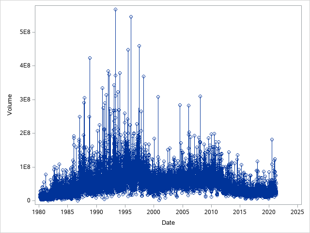
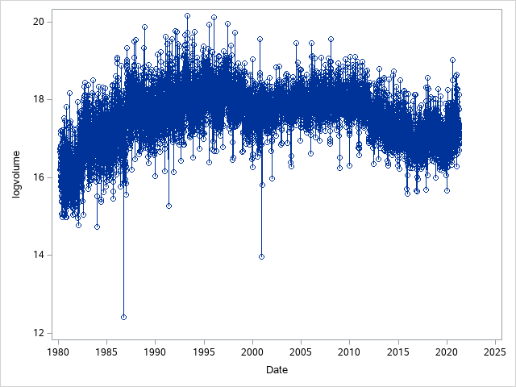
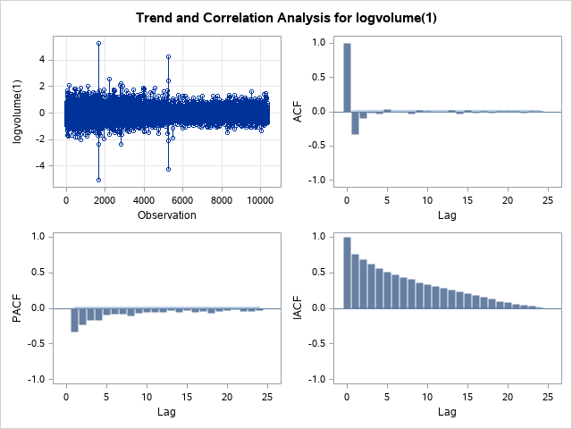

# Intel stock forecast for the next 5 years using ARIMA

### Visualising and Cleaning the Data

```
data intel_stock;
infile '/home/u40846561/Projects/INTC.csv' dlm = ',' firstobs = 2;   
input Date anydtdte10. Volume;
format Date date10.;
logvolume = log(Volume);
run;

proc sgplot data = intel_stock;
series x = Date y = Volume/markers;	
xaxis values = (1 to 5000 by 1);	
run;
```



Firstly, I imported the data and gave the date variable a format that the program could read. This is important such that when we plot our graphs they are easier to read as it will show the exact date for each point instead of some arbitary number. After this, I plotted the data on a time series plot to visualise the data. From this plot I saw that the variance increased over time quite dramatically. This meant I then took a new variable called "logvolume" which is the logarithm of the volume variable to make the variance constant through out the time series plot.

```
proc sgplot data = intel_stock;
series x = Date y = logvolume/markers;	
xaxis values = (1 to 5000 by 1);	
run;
```



The plot shows a how the variance has been made constant by taking the logarithm of volume. We can also see two significant outliers that are resolved later. The plot however, shows that there is a non-zero mean.

### Building and optimising a ARIMA model

```
proc arima data = intel_stock plots = all;
identify var= logvolume(1);
estimate p = 5 q = 5;
outlier id=Date;
run;
```

Now that I have obtained a time series with constant variance I need to make it stationary and that I need the mean of the model to be zero. We can do this by taking the first-difference of the variable logvolume. I then obtained the ARIMA plots using the code above to check if taking the first-difference worked.


